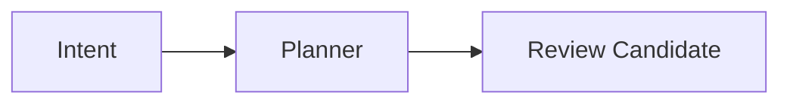

# 文档写作约定

本文面向维护仓库文档的开发者。仓库文档以 Markdown 为唯一源格式，同时服务 Agent、GitHub 与 Lush Web。

## 信息层级

- 根 `README.md`：项目定位、最短启动路径和主要入口。
- `docs/README.md`：完整文档地图与推荐阅读顺序。
- `docs/deployment/`：安装、启动、远程访问、Agent 配置与验证；面向部署者与 AI coding agent，不等于功能参考。
- `docs/design/`：模块目标、设计理念与取舍；修改模块前的阅读入口，不等于已实现能力。
- `docs/engineering/`：源码边界、不变量和实现设计。
- `docs/reference/`：CLI、RPC、HTTP 与 Web 路由参考。
- `docs/contributing/`：开发和文档维护约定。

每个新增目录必须包含 `README.md`，解释该层回答的问题并链接到主要文档。不要仅靠文件名让读者猜阅读顺序。

## 模块理念

理念文档必须包含用户目标、原则、取舍、反例与验收问题，并链接到实现入口；不要仅列待办或控件。新增理念后同步 `docs/design/README.md`、模块地图与 Agent 阅读指引。未知的用户偏好先问，不得自行给所有模块编造哲学。工程文档记录当前实现及限制，避免将愿景写成完成状态。

## Markdown 约定

1. 每篇文档只使用一个一级标题。
2. 标题后用一段话说明本文回答什么问题、面向谁，并尽量指出实现入口。
3. 一个事实只保留一个权威位置；其它文档使用相对链接，不复制整段规则。
4. 仓库内链接必须使用相对路径并显式包含 `.md`。
5. 不使用 MDX、JSX、内嵌脚本或承担正文职责的原始 HTML。
6. 连续阅读的章节尽量控制在 60–120 行；超过约 150 行时优先拆成总览和短章。纯参考表可以更长，但也应按职责拆分。
7. 连续阅读线在页首显示整条路线与当前位置，页尾提供上一篇 / 下一篇；文件名需要排序时使用稳定数字前缀。
8. 一个索引只回答“从哪里开始”和“接下来读什么”，细节放进短章，避免索引本身重新长成正文。
9. 规范性规则明确使用“必须”“不得”“仅允许”等词语。
10. 图表不能承载唯一信息，图前后必须有可独立阅读的文字说明。

## Mermaid 约定

流程图使用 fenced Mermaid，使 GitHub、Agent 与 Lush Web 读取同一份源码：

````markdown

````

只使用 GitHub 稳定支持的 `flowchart`、`sequenceDiagram`、`stateDiagram-v2`、`classDiagram` 或 `erDiagram`。单图尽量不超过 30 个节点；禁止 `click`、外部资源、HTML label 和实验性布局。大图按产品流程、runtime 和 Git 子系统拆分。

流程节点优先使用 `node("标签")` 的圆角形状；决策使用 `{}`，起点 / 终点可使用 `(["标签"])`。避免整图都是直角矩形，也不要仅靠颜色传递语义。Lush Web 使用柔和的本地主题、圆角、曲线连接和适配深浅模式的配色；GitHub 仍按 Mermaid 源码自身的节点形状渲染。

Lush Web 仅在文档视图加载本地 Mermaid 资源，并使用 `securityLevel: strict`。Agent 输出中的 `mermaid` 围栏仍按普通代码显示。

## 自动检查

```bash
bun run docs:check
```

检查项包括：

- `docs/` 中没有 authored `.html` 文档；
- 每篇 Markdown 恰好有一个一级标题；
- 相对链接目标存在且不逃出仓库；
- Mermaid 围栏正确闭合；
- 超长文档给出警告。

运行时生成的 `.lush/verify/*/report.html` 是验收 Artifact，不属于仓库文档，不受“文档全部使用 Markdown”约束。Web 的 `index.html` 同样是程序资源，不是文档源。
