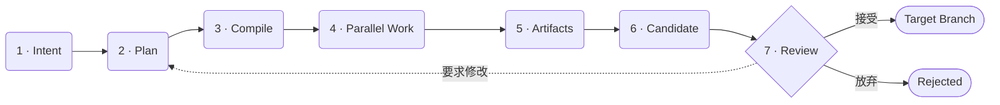

# Lush 核心架构

本文用一条主链建立全局心智模型；执行、信息集成与验收细节拆成后续短章。若想先按实际操作走一遍，请从[行动任务流程](task-flow.md)开始。

> 连续阅读：**架构总览** → [执行模型](engineering/execution-model.md) → [验收闭环](engineering/review-loop.md) → [工程索引](engineering/architecture.md)

> **核心公式：Intent-first + Candidate-first，Branch-backed。**

## 四个中心

| 中心 | 核心对象 | 负责 |
|---|---|---|
| 用户目标 | Intent | 保存用户原话、目标分支、流程模式与整体交付状态 |
| 执行 | Task + Agent + Run | 把稳定工作身份与单次模型调用分开，支持等待、唤醒与重试 |
| 信息集成 | Artifact | 保存提交、测试证据、报告、发现、风险与摘要 |
| 验收 | Review Candidate | 固定 integration commit、baseline、报告和用户决策 |

Branch 与 Commit 属于代码交付基础设施：Branch 负责隔离、集成和恢复，Commit 提供不可变身份。Notice、Plan gate 与 Candidate decision 只在存在歧义、风险、冲突或最终交付时要求用户介入。

## 一条主链

运行时的职责边界是：

1. 模型理解语义、拆解目标、实现代码并综合结论。
2. 确定性 runtime 编译 Plan、维护依赖、控制资源、持久化状态并串行执行 Git 写操作。
3. Integration Service 只在私有 Intent 分支内部聚合，不自动修改用户目标分支。
4. 用户最终接受固定 commit，而不是一个仍可能移动的 branch 名或笼统的“任务完成”。

## 实体边界

| 实体 | 负责 | 不负责 |
|---|---|---|
| Intent | 原始目标、模式、目标分支、整体状态 | 单次模型调用细节 |
| Plan | 版本化拆解、依赖、验收标准、风险 | 调度进程与 Git 操作 |
| Task | 稳定目标、角色、关系、状态、工作区及完成条件 | 等同于某一次模型调用或常驻进程 |
| Agent | 与 Task 一对一的长期执行身份及连续会话 | 永久有效的 invocation 凭证 |
| Run | 一次 provider invocation、模型、成本、结果和错误 | 长期业务身份 |
| Artifact | 结果、commit、报告、证据、发现和风险 | 控制 Task 生命周期 |
| Review Candidate | 固定 commit、基线、报告和验收状态 | 可变 branch 的未来内容 |
| Notice / Decision | 高风险计划、实质歧义、冲突与最终接受 | 普通进度通知 |
| Event | 不可丢失的审计与恢复事实 | 直接充当用户摘要 |

Task 暂时也是 WorkItem 的兼容投影；`agent_runs`、`artifacts` 与 `review_candidates` 保存逐步迁移后的结构化事实。

## 接下来读什么

- [执行模型](engineering/execution-model.md)：Task、Agent、Run、Plan Compiler 与 Artifact 如何协作。
- [验收闭环](engineering/review-loop.md)：产品轴、Git 轴、Candidate、反馈与安全边界。
- [工程架构索引](engineering/architecture.md)：按源码主题进入实现细节。

---

[下一篇：执行模型 →](engineering/execution-model.md)
