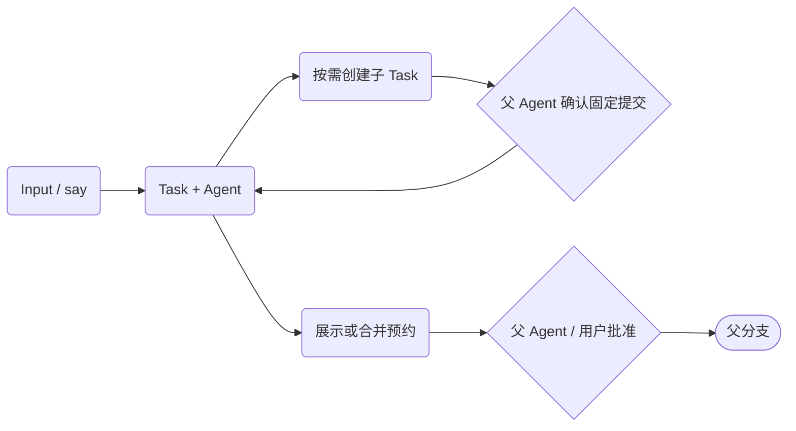

# Lush 核心架构

本文面向初次理解系统的开发者；使用顺序见[一条 say 输入如何交付](task-flow.md)，实现入口见[工程架构索引](engineering/architecture.md)。

> 连续阅读：**架构总览** → [执行模型](engineering/execution-model.md) → [交付与验收](engineering/review-loop.md) → [工程索引](engineering/architecture.md)

## 项目、输入与任务

一个 daemon 绑定一个 canonical 项目，数据库状态在 `<project>/.lush/`。业务实体是 Input、Task、Agent、Message、Notice、Event；Git 分支与 worktree 承载代码隔离。一次新 `say` 保存 Input（原话、引用）并创建与它直接关联的 Task；Task 拥有自己的分支和工作区，而非由 Plan 编译出来的 worker。main 或显式绑定的分支所有者 Task 是它的父节点。Task 可以再派独立子 Task，也可以不改代码直接回答。

每个 Task 的 Agent 身份跨唤醒保持，真正的模型调用记录为独立 Run。消息和子任务结算先持久化；等待用户或子任务时释放 invocation 槽。Event 保存审计事实，Notice 承载必须由用户决定的问题。提交、测试和结果可记录为 Artifact；Run、Artifact 是执行事实，不是新的顶层调度对象。

## 交付边界

子任务完成不推进父分支；直接父 Agent 只有在分支与工作区符合条件时才能确认固定子提交并快进。say 的合并预约会冻结源提交与父分支基线，请求不等于批准。main/owner 的交付需要用户批准固定提交与基线；分支分歧在子侧处理，不能靠覆盖父工作区蒙混过关。Task `completed`、已集成到直接父分支、已进入 main 是三件不同的事。

旧 `input.submit` / 批量 `draft.commit` 的 Intent → Plan → 私有集成 → Review Candidate 链仍用于历史任务的兼容收尾；它不是新 say 的主链，Candidate 也不是新 say 的必经交付对象。细节见[历史流程](task-flow-1-planning.md)和[旧协议参考](reference/rpc/inputs.md)。

---

[下一篇：执行模型 →](engineering/execution-model.md)
