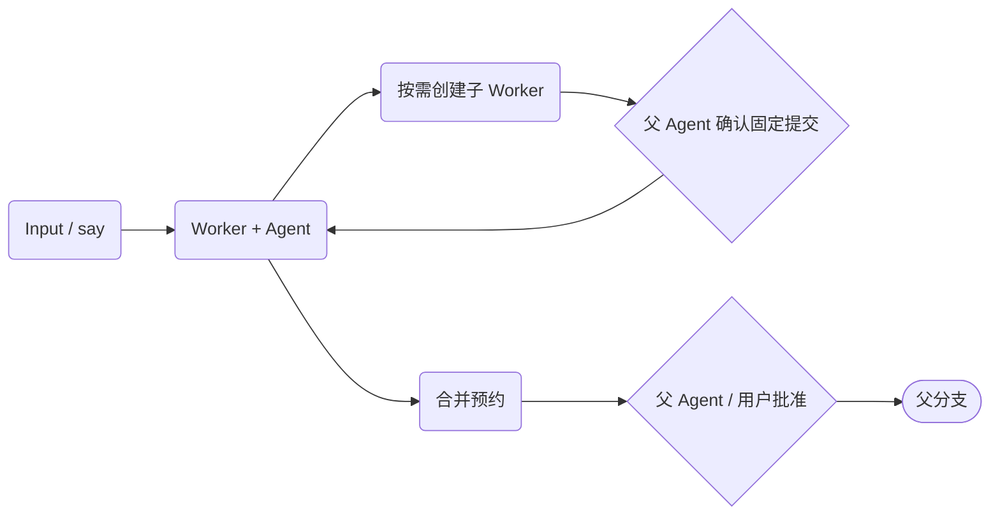

# Lush 核心架构

本文面向初次理解系统的开发者；使用顺序见[一条 say 输入如何交付](task-flow.md)，实现入口见[工程架构索引](engineering/architecture.md)。

> 连续阅读：**架构总览** → [执行模型](engineering/execution-model.md) → [交付与验收](engineering/review-loop.md) → [工程索引](engineering/architecture.md)

## 为什么以 Worker 为中心

Lush 的中心对象是 **Worker**。这里的 Worker 是 **Agent + Process**：一个跨唤醒保持的 Agent 身份，加上一段持续推进、等待用户或子 Worker 之后仍可继续的过程；它不是一个待办条目。用户写下的是目标，而不是工作清单；这条目标立即成为一个 Worker，而不是 planner 临时编译出来的 worker。理解这一选择，后面的输入、Agent、Git 与交付设计才讲得通。

- **目标是持久的，模型调用是短暂的**：Worker 保存目标、父子关系、状态、消息、工作区与分支；Agent 与 Worker 一对一，但只在被唤醒时占用一次模型调用（Run）。等待用户或子 Worker 时 Worker 释放执行槽，下一轮仍以同一身份继续。一次调用返回不等于 Worker 终结。
- **每个 Worker 有独立的代码边界**：Worker 从父分支的已提交 tip 创建自己的分支与 worktree，并行工作互不覆盖。代码事实留在 Git，业务与调度事实留在 SQLite，二者不互相冒充。
- **Worker 可以递归分解，但子 Worker 不是等待式调用**：Agent 判断亲自完成还是派独立子 Worker；子 Worker 有自己的 Worker 身份与 worktree。它完成后只发持久信号，是否把它的固定提交集成进父分支由父 Agent 或用户决定。
- **交付以 Worker 为单位，人类把关**：合并请求冻结精确 commit 与父分支基线，父分支在请求未决时受保护；结算一个 Worker 与把它的代码推进父分支是两件事，默认必须由人或父 Agent 明确确认，不自动推进父分支。

因此 Worker 同时是身份、目标、协作单元与交付单元；Plan、Candidate 等结构只是历史协议的产物，不是新 say 必经的前置对象。Worker 的字段与状态约束见[核心实体](engineering/entities.md)与[生命周期不变量](engineering/invariants.md)，一次工作如何跨轮继续见[执行模型](engineering/execution-model.md)。

## 项目、输入与 Worker

Lush UI（浏览器或 Electron）通过整机入口 Lush Host（`bin/lush-host`）访问项目；Host 登记项目、校验身份、按需连接或启动对应 lushd，不保存Worker事实，也不调度跨项目工作。一个 lushd 绑定一个 canonical 项目，数据库状态在 `<project>/.lush/`。CLI `lush` 可作为另一客户端直接访问项目 lushd。业务实体是 Input、Worker、Agent、Message、Notice、Event；Git 分支与 worktree 承载代码隔离。一次新 `say` 保存 Input（原话、引用）并创建与它直接关联的 Worker；Worker 拥有自己的分支和工作区。main 或显式绑定的分支所有者 Worker 是它的父节点。Worker 可以再派独立子 Worker，也可以不改代码直接回答。

```mermaid
flowchart LR
    input("Input / say") --> task("Worker + Agent")
    task --> child("按需创建子 Worker")
    child --> confirm{"父 Agent 确认固定提交"}
    confirm --> task
    task --> request("合并预约")
    request --> approve{"父 Agent / 用户批准"}
    approve --> target(["父分支"])
```

每个 Worker 的 Agent 身份跨唤醒保持，真正的模型调用记录为独立 Run。消息和子 Worker 结算先持久化；等待用户或子 Worker 时释放 invocation 槽。Event 保存审计事实，Notice 承载必须由用户决定的问题。提交、测试和结果可记录为 Artifact；Run、Artifact 是执行事实，不是新的顶层调度对象。

## 交付边界

子 Worker 完成不推进父分支；直接父 Agent 只有在分支与工作区符合条件时才能确认固定子提交并快进。say 的合并预约会冻结源提交与父分支基线，请求不等于批准。main/owner 的交付需要用户批准固定提交与基线；分支分歧在子侧处理，不能靠覆盖父工作区蒙混过关。Worker `completed`、已集成到直接父分支、已进入 main 是三件不同的事。

旧 Intent / Plan / Candidate、草稿、快速路由、效果展示、介绍、托管模式与旧合并编排的旧行、会话与工作区保留在磁盘上，不迁移、不删除，但不再有公开 RPC / CLI / Web 入口，也不会自动启动或重放；当前可调用面见[核心 API 收敛](engineering/core-api.md)。

---

[下一篇：执行模型 →](engineering/execution-model.md)
