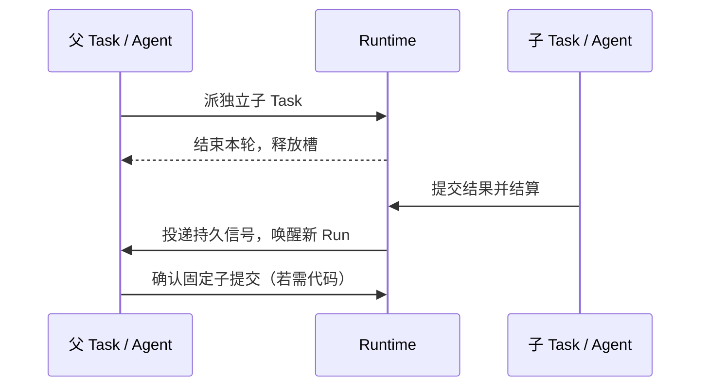

# 执行模型：Task、Agent 与 Run

本章面向维护调度与 Agent 的开发者，说明当前 say 路径的一次工作如何跨多轮调用继续。历史 Plan 编译单独见[旧协议意图层](intent-layer.md)。

> 连续阅读：[架构总览](../core-architecture.md) → **执行模型** → [交付与验收](review-loop.md) → [工程索引](architecture.md)

## 稳定身份与单次调用

Task 持久保存目标、父子关系、状态、消息和工作区；Agent 与 Task 一对一，但不是常驻进程。每次 provider invocation 都有独立的 `agent_runs` 记录、临时凭证和结果。等待子任务或用户时 Task 释放执行槽；下一轮继续使用同一 Task/Agent 身份，但旧凭证不能复用。[一次 invocation](invocation.md)描述收件箱、恢复和安全抢占。

- 新 say 输入直接拥有 `agent` Task，不创建 planner/scheduler。父 Agent 可按需派子 Task；子 Task 结算只发送信号，不自动合并。
- 一轮正常返回后的 say Task 通常处于 `waiting`，保留分支与再次唤醒能力；`awaiting` 等用户答复。终态 Task 不允许活动后代。
- 用户追加输入先持久化，再尝试在可证明的安全点收尾：当前 Pi 可在 `turn_end` 抢占，记录 `preempted` Run；无安全点后端只在自然轮末交付，不把硬杀冒充安全中断。
- 未知外部副作用的中断不自动重放。Run 结束、Task 结算、代码集成互不等价。

## 旧协议兼容

旧客户端的 `input.submit` 与 `draft.commit` 仍可创建 planner、结构化 spec 与 worker DAG；Plan Compiler 确定性建依赖，`code` 依赖决定代码基线。control / execution 两条容量车道仍存在，但普通 say 不调用规划模型，也不走旧自动集成或 Candidate 生成。旧路径见[输入和规划](inputs-and-planning.md)、[意图层](intent-layer.md)。

---

[← 上一篇：架构总览](../core-architecture.md) · [下一篇：交付与验收 →](review-loop.md)
