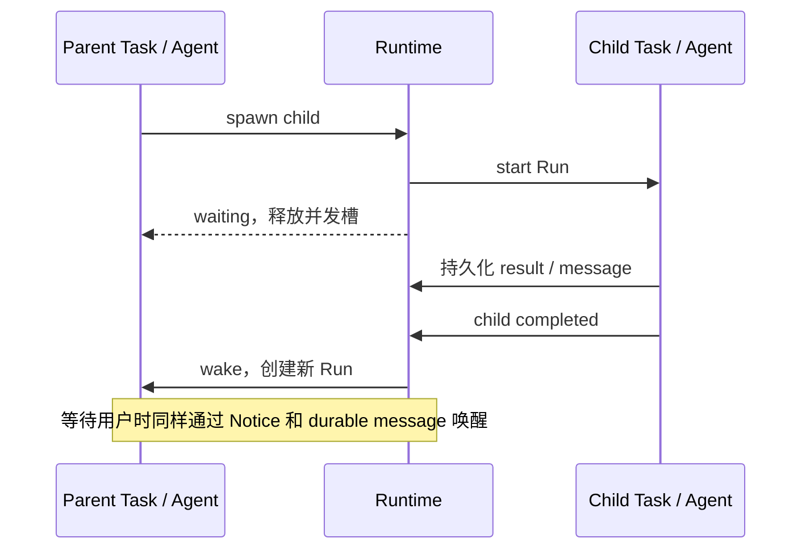

# 执行模型：Task、Run 与 Artifact

本章解释稳定工作身份、单次模型调用、确定性 Plan 编译和结构化成果之间的边界。控制面的实现细节继续见[Intent、Plan 编译与验收候选](intent-layer.md)。

> 连续阅读：[架构总览](../core-architecture.md) → **执行模型** → [验收闭环](review-loop.md) → [工程索引](architecture.md)

## Task、Agent 与 Run

Task 不是一段 prompt，也不是常驻进程，而是 runtime 持久化的工作单元。它保存目标、角色、父子关系、依赖、状态、消息、工作区与结果。

Agent 是与 Task 终身一对一的执行身份，例如 `worker#7`；每次真正调用模型才产生一个 Run。等待结束后可以创建新 Run 继续工作，但 Task 和 Agent 身份不变。

| 维度 | 裸 Agent 调用 | Lush Task 模型 |
|---|---|---|
| 身份 | 通常等同于一次进程或模型调用 | Task ID 与 `<role>#<task-id>` 跨多次唤醒保持稳定 |
| 生命周期 | 启动、执行、返回 | `queued → running → waiting / awaiting → completed` 由 runtime 持久化管理 |
| 协作上下文 | 主要隐含在 prompt 和 transcript 中 | 目标、关系、依赖、消息、工作区和结果均有结构 |
| 等待方式 | 阻塞调用方或持续占用进程 | 释放 invocation 与并发槽，由事件精确唤醒 |
| 恢复审计 | 进程退出后容易丢失现场 | Task、Message、Event 与每次 Run 都可追溯 |



多 Agent 的并行来自“所有就绪 Task 独立推进”，协调来自持久状态、依赖和事件，而不是把一组 Agent 进程一直挂在内存里。

一次 invocation 有四种结局，runtime 分开记账，不互相冒充：正常返回（`completed`）、超时（`failed`）、用户取消（`cancelled`，必要时硬杀进程组）、以及**安全抢占**（`preempted`）。安全抢占只在后端能声明一个“已经没有任何工具在跑”的边界时启用（当前是 Pi 的 `turn_end`）：用户追加输入时 runtime 写一次性请求，Agent 侧扩展在该边界主动收尾，Run 记成 `preempted`，Task 回到 `queued`/`waiting` 而不算失败，也不重建工作区；新一轮会先读到那条输入。没有这种边界的后端继续在轮末投递，不强行杀进程冒充安全点。

## Plan 编译与并行调度

Planner 做语义判断，runtime 做确定性编排。Planner 写完结构化 spec 后，Plan Compiler 在事务中建立工作节点与依赖，不再经过 scheduler agent，不消耗额外模型调用，也不存在全项目 scheduler 批次锁。

```text
depends_on: [work-3, work-5]   # 运行前置条件，可有多个
code_base: work-3              # 代码从哪里开始，最多一个
integration_target: intent-42  # 最终聚合到哪里
```

运行资源分成两条 lane：

| Lane | 典型角色 | 目的 |
|---|---|---|
| Control | planner、综合、冲突分析 | 长 worker 不能饿死新输入的理解和规划 |
| Execution | worker、research、verifier、merger | 依赖未满足或等待用户时不占执行槽 |

`code` 依赖同时决定运行顺序与代码基线；`order` 依赖只决定运行顺序。机械的 ID 翻译、依赖校验和 Task 创建全部由代码完成。

## 结构化信息集成

每次成功 Run 的最后输出形成 Artifact。文本仍保留，但核心结果使用统一结构表达，以便 reducer 持续生成 Intent 摘要：

```json
{
  "outcome": "success",
  "summary": "完成了什么",
  "changes": [{ "area": "src/auth", "description": "新增刷新逻辑" }],
  "evidence": [{ "command": "bun run test", "exitCode": 0, "summary": "344 passed" }],
  "decisions": [],
  "risks": [],
  "artifacts": [{ "kind": "commit", "value": "abc123" }],
  "followups": []
}
```

代码 reducer 聚合确定性事实；只有语义冲突、计划重写或最终叙述确有必要时，才启动模型做综合。Transcript 用于追溯，不是理解成果的必经入口。

---

[← 上一篇：架构总览](../core-architecture.md) · [下一篇：验收闭环 →](review-loop.md)
