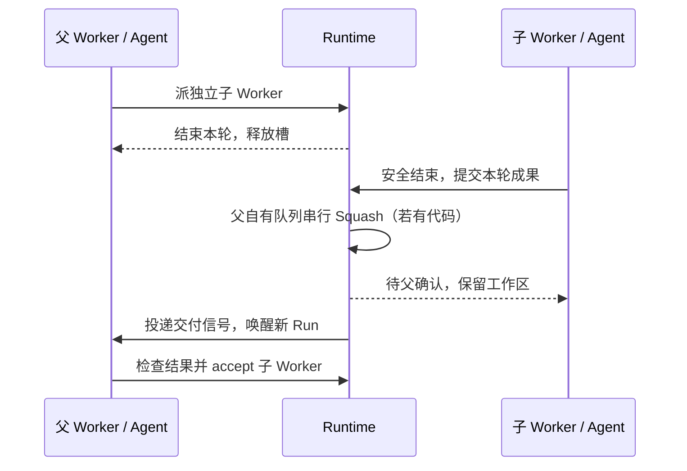

# 执行模型：Worker、Agent 与 Run

本章面向维护调度与 Agent 的开发者，说明当前 say 路径的一次工作如何跨多轮调用继续。

> 连续阅读：[架构总览](../core-architecture.md) → **执行模型** → [交付与验收](review-loop.md) → [工程索引](architecture.md)

## 稳定身份与单次调用

Worker 持久保存目标、父子关系、状态、消息和工作区；Agent 与 Worker 一对一，但不是常驻进程。每次 provider invocation 都有独立的 `agent_runs` 记录、临时凭证和结果。等待子Worker或用户时 Worker 释放执行槽；下一轮继续使用同一 Worker/Agent 身份，但旧凭证不能复用。[一次 invocation](invocation.md)描述收件箱、恢复和安全抢占。

```mermaid
sequenceDiagram
    participant P as 父 Worker / Agent
    participant R as Runtime
    participant C as 子 Worker / Agent
    P->>R: 派独立子 Worker
    R-->>P: 结束本轮，释放槽
    C->>R: 安全结束，提交本轮成果
    R->>R: 父自有队列串行 Squash（若有代码）
    R-->>C: 待父确认，保留工作区
    R->>P: 投递交付信号，唤醒新 Run
    P->>R: 检查结果并 accept 子 Worker
```

- 新 say 输入直接拥有 `agent` Worker，不创建 planner/scheduler。父 Agent 可按需派子 Worker；新 child 默认开启锁定的自动合并 hook，安全点交给父 Worker 自有队列的 runtime 串行 Squash，不新建 merge Worker、不改父子关系、不额外调用父 Agent。无提交的干净 child 只交付结果、等父确认。
- 一轮正常返回后的 say Worker 通常处于 `waiting`，保留分支与再次唤醒能力；`awaiting` 等用户答复；用户主动中断发送暂停意愿（`interrupt_state=requested`），当前调用在安全点收尾后才停在非终态 `paused`。继续立即接受：未认领则撤销，已触发则内部排队等待旧调用退出（`interrupt_state=resuming`），避免调用重叠。暂停请求期间也可追加消息或保存下一次调用的运行设置，不热改旧调用。终态 Worker 不允许活动后代。
- 新式 version 2 合并后进入非终态 `awaiting_acceptance`，不自动调用 Agent；追加输入继续原 Worker，say 由用户验收、child 由其运行中的直接父 Agent 检查并 `worker.accept` 确认才 completed，归档另行显式操作。历史已合并Worker显式恢复与安全同步见[持续迭代](task-iteration.md)。
- 用户追加输入先持久化，再尝试在可证明的安全点收尾：当前 Pi 可在 `turn_end` 抢占，记录 `preempted` Run；无安全点后端只在自然轮末交付，不把硬杀冒充安全中断。
- 未知外部副作用的中断不自动重放。Run 结束、Worker 结算、代码集成互不等价。

## 历史数据边界

旧 version 1 人工确认语义不改，旧 version 2 merge 身份与在途重挂只按明确预约／审计兼容恢复；完整协议见[分支合并](merge.md)。旧 Intent / Plan / Candidate 与 planner / scheduler 的记录、会话与工作区保留在磁盘上，不迁移、不删除，但不再有公开入口，也不会自动启动或重放。control / execution 两条容量车道仍是运行时的准入机制，普通 say 不调用规划模型。当前可调用面见[核心 API 收敛](core-api.md)。

---

[← 上一篇：架构总览](../core-architecture.md) · [下一篇：交付与验收 →](review-loop.md)
