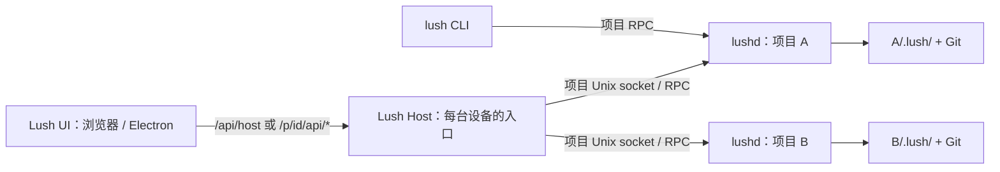

# Lush 三层边界

- **UI**（`src/ui/web/assets/`、`src/ui/desktop/`）：不读取本机 socket、项目数据库或 Git。项目操作必须使用当前页面 `/p/<id>/` 的身份；宿主级列表和文档不带项目身份。
- **Host**（`bin/lush-host`、`src/host/`、HTTP 适配器 `src/ui/web/server.js`）：处理浏览器认证、项目登记、路由、连接缓存和有界状态读取。`GET /api/host/projects` 只检查已登记目录对应的 socket，不启动 daemon；选择或打开项目时才按需启动／连接。`launcher.json` 是界面缓存，不是任务数据库。独立桌面窗口有自己的临时 Host，关闭窗口不停止项目 lushd。
- **lushd**（`bin/lushd`、`src/daemon/`、`src/core/`、`src/persistence/`、`src/rpc/`）：一项目一进程，绑定 canonical 路径，事实仅在 `<project>/.lush/`，执行 Agent 与项目内调度。Host 不复制事实、不做跨项目调度。UI 当前通过有界轮询读取项目消息与状态，Host 只把响应转交相应页面；尚无后台推送通道。CLI `lush` 也可直接通过项目 socket 访问 lushd。

对外入口：`bun run host|host-status|host-restart|host-stop`，`bun run lush-host`（前台），以及原有项目端 `bun run start|daemon-restart|stop`。原 `web*` 命令、`bin/lush-web`、`/api/launcher*` 已移除；原有 `launcher.json` 和 `web.json` 留在原用户配置目录，不迁移或清除项目数据。运行中的旧 Host 不会自动换代码：确认没有需要保留的登录会话后重启 Host；项目代码变化还需分别重启相应 lushd。
