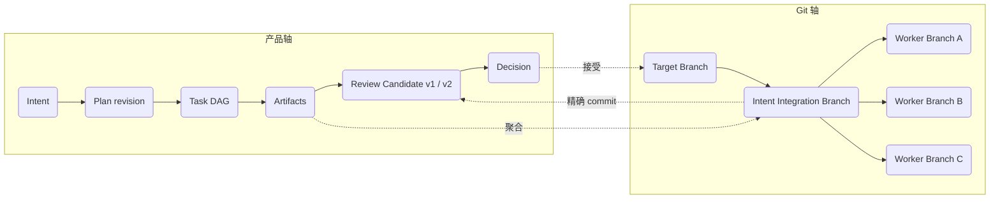
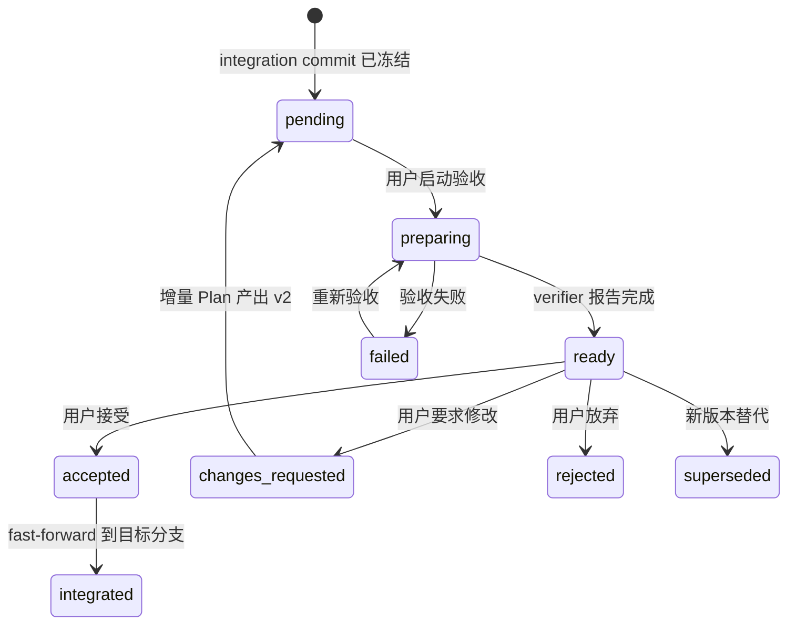
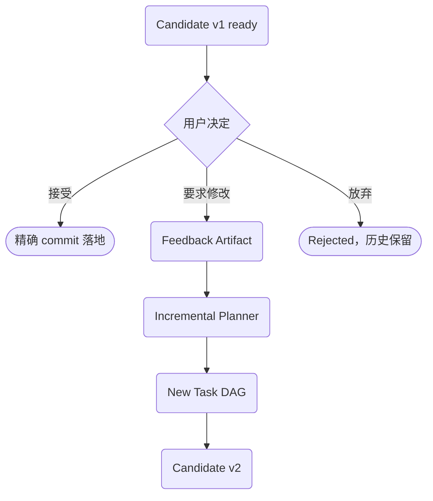

# 验收闭环：Candidate、反馈与安全落地

本章说明成果如何从私有 Intent 分支成为绑定精确 commit 的 Review Candidate，以及用户要求修改后如何形成下一版。

> 连续阅读：[架构总览](../core-architecture.md) → [执行模型](execution-model.md) → **验收闭环** → [工程索引](architecture.md)

## 产品轴与 Git 轴

产品界面围绕 Intent、成果与验收组织；分支图保留为 Git 诊断视图。用户不需要通过提交拓扑理解目标，但底层仍依靠 worktree、分支谱系与 fast-forward 规则保证安全和恢复能力。

## Review Candidate 生命周期

Candidate 创建时同时固定 integration commit 与 baseline commit。Verifier 在两边运行同一验收场景，生成自包含 HTML 报告。接受前 runtime 再次校验分支 tip 仍等于候选 commit；如果已经移动，旧批准不得复用，必须生成新版本。

## 反馈闭环

要求修改不会覆盖旧候选：反馈形成同一 Intent 下的新输入，增量 planner 产出新的 Task DAG 与 Candidate v2。旧 commit、旧报告和旧决策继续保留，因而每次验收都有明确对象和审计链。

## 安全与恢复原则

- **项目级作用域**：一个 daemon 绑定一个 canonical 项目目录，状态固定在项目的 `.lush/`。
- **短期凭证**：Agent token 只在当前 invocation 有效，数据库只保存 SHA-256。
- **未知副作用不重放**：崩溃后的 running Run 标记失败，由用户检查现场并明确重试。
- **Git 写操作串行**：不做 shell 插值；compare-and-swap 与每次重新校验避免静默覆盖。
- **验收绑定 commit**：用户接受不可变的树；branch 漂移后旧批准不得复用。
- **历史与磁盘分离**：Run、Artifact、Event 可长期保留；worktree 与 branch 按安全门独立回收。

## 界面信息架构

| 视图 | 回答的问题 |
|---|---|
| Intent 工作台 | 我提出的目标现在怎样？有什么成果需要验收？ |
| Execution DAG / 任务树 | 哪些工作并行、依赖谁、为什么被阻塞？ |
| Candidate Review | 实际结果是什么？我接受的是哪个 commit？ |
| Decision Queue | 现在真正需要我决定什么？ |
| Branch Diagnostics | 底层 Git 为什么分歧、缺失、落后或不能集成？ |

默认产品入口是 Intent 工作台。Branch 和 worktree 继续承担代码隔离、集成与恢复，但退回基础设施层。

## 当前实现与演进边界

现有 SQLite、项目 daemon、Task / Agent 身份、worktree 隔离、事件审计、短期 token、恢复策略和最终用户批准继续保留。迁移采用加表、加列与兼容 RPC；旧 Task、spec 与 branch 历史仍可读取。

架构判断标准不是“层数越少越好”，而是：

- 语义判断交给模型，确定性工作交给 runtime；
- 用户围绕目标和结果行动，Git 围绕安全和恢复行动；
- 关键事实可持久化、可验证、可追溯；
- 最终只落地用户实际验收过的 commit。

---

[← 上一篇：执行模型](execution-model.md) · [下一篇：工程架构索引 →](architecture.md)
