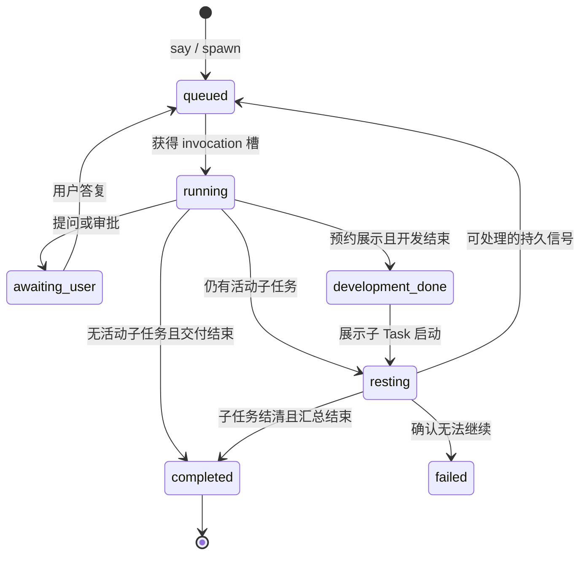

# Task 中心输入架构（待实施设计）

本文是已确认的目标行为与实现契约，**不是当前功能说明**。面向修改输入、Task、Agent、Git 和 UI 的开发者；当前代码行为仍见[输入和规划](inputs-and-planning.md)与[一次 invocation](invocation.md)，分阶段落地见[迁移与验收](task-centered-input-rollout.md)。

## 目标与边界

- CLI 与 Web 均提供 `draft add`（只缓存）、`say TEXT`（立即发送）、`say --draft ID`（发送指定草稿）；Web 的草稿行也能单条发送。不得让 Web 输入框的普通发送暗中先提交全部未选草稿；多条发送必须显式逐条发起并分别报告结果。
- 一条新的 say 保留一条 Input（原话、引用、草稿来源）与一条直接关联的 Task；**不创建 planner/scheduler 占位**。新 Task 与其 Agent 身份一对一，Agent 可以自行派生任意有权限的子 Task，不预先用 planner/worker/research 分类用户输入。
- 新任务从当前已绑定的父分支提交 tip 创建自己的分支/worktree，成为该分支所有者 Task 的子节点。main 分支有唯一逻辑常驻根 Task：平时静息，不持续占模型调用槽。旧任务及历史仍按旧协议展示、审计和安全收尾；只对新 say 启用新协议。
- `input_routes` 前缀匹配不得参与新 say；旧记录中的 `input.route` 事件只能作为历史事实读取。选区引用仍是 Input/Draft 的附件；新 Task 每轮调用可得到引用快照与当前状态。
- 普通 say 一律创建代码 worktree，包括只读问题；允许 Agent 不修改代码直接回答，但这条输入的分支仍需按安全规则回收。展示、快速介绍、历史解释等已有专用入口不自动变成 say。

## 身份、归属与 Git

- 必须持久标识新旧 Task 协议及新 Task 的阶段，不得根据 `role` 名或 task ID 猜测。新 Input 的 `task_id` 直接指向 say Task；main Task 不属于某条 Input。旧 `inputs.task_id` 仍指向旧 planner，不能批量改写。
- `say` 默认以当前选定分支的**显式绑定 Task**为父；CLI 未指定时取项目当前检出分支，Web 使用界面选中的父分支。不存在绑定、存在多个候选或是游离 HEAD 时拒绝并说明如何绑定；不得静默挂 main，也不得把旧任务/任意外部分支猜成新父节点。分支绑定的写入必须检验本地 ref 与唯一所有者，并审计绑定动作。
- 父 Task 创建子 Task 时，可写子任务总有独立分支/worktree；只读子任务也以 Task 为身份，但不得借共享目录写入父分支。创建时固定父分支已提交起点，绝不携带主工作树未提交改动。创建、任务落库、引用/草稿回写之间要有补偿与恢复路径；不能留下一个“草稿已提交但 Task 不存在”的成功响应。
- 子任务交付后发送含固定 commit 的信号，父 Task **确认**后才从子侧安全集成到自己的分支；父 Agent 获得集成完成的新工作区上下文后才继续处理依赖该代码的工作。并发 sibling、父分支前进和分歧都走 Git 串行边界、谱系检查与 compare-and-swap；冲突保留分支并交回父 Task/用户决定，不得强制 reset、自动丢弃或偷偷在父工作区改文件。
- main Task 是根任务及合并请求接收者，不等于拥有绕过人工批准的 Git 权限。main 可按需分析和准备合并，但推进 main 前必须让用户批准**固定的子 commit 与目标基线**；批准后仍须在 Git 写区间复核，任何漂移均使原批准失效。可复用 Candidate 证据或 Notice 展示，但新协议不能依赖旧 planner 才能生成验收对象。

## Task 与 Agent 生命周期

新任务至少区分 `queued`、`running`、`resting`（无调用、待信号/待子任务）、`awaiting_user`、`development_done`（展示预约专用）及终态 `completed`/`failed`/`cancelled`。这是语义状态；实际字段可分为执行状态、交付阶段及预约状态，避免把 Git 集成结果误当 Task 完成。

- 一次 invocation 只持有一次性凭证；Task/Agent 身份、会话和 worktree 跨轮保留。Agent 派出子 Task 后本轮返回即释放调用槽；只要仍有活动子 Task，父 Task 不得标为 completed，且不得忙轮询。子任务结算唤醒父 Task，让 Agent 汇总或继续工作；没有子任务且没有待决事项时，一轮正常完成可以使普通 Task 终结。
- main Task 不遵循普通 Task 自动终结规则；无信号时保持 resting。启动 daemon 只确保 main Task 的持久身份存在，不启动空转 Agent。重启恢复同一个身份，不重复建根。
- 完成是 agent 本轮输出、Task 终态、代码已集成三个不同事实；不得把 `Run completed` 当成「子提交已合并」或「用户已批准」。终态 Task 不允许活动后代：展示预约要先进入 `development_done`，完成展示后才正式终结。
- 显式取消/超时与**为了投递重要信号而抢占**必须区分。普通 provider 的 abort 当前会 SIGKILL 进程组，不能把它宣称为安全点：新协议先将信号持久化，只在后端能声明的安全点收尾本轮（当前是 Pi 的 `turn_end`：本轮工具都结束；`tool_call` 不是边界，同一条 assistant message 的调用可并行）；无法报告安全点的后端延至自然轮末。确实被抢占的 Run 与 completed / failed / cancelled 并列记成 `preempted`，不把 Task 标为 failed，不删除未提交工作，也不重建工作区；工具副作用不确定时不得自动重放调用。

## 持久信号与唤醒

Task 包裹 Agent，信号先进 Task 而非直接写入会话文件。新协议须为信号定义 `source_task_id`、`target_task_id`、类型、不可重复的来源键、生成时间、有界载荷及投递/消费游标；使用现有 Message/Event 作为业务事实，不另造裸 agent 调度器。至少支持子任务完成/失败、代码待集成/集成结果、预约合并请求、用户答复和取消；自由文本消息仍保留。

1. 子 Task 的结算、信号与审计事实在同一事务持久化；先落库再 kick。重复回调不得重复发起合并或唤醒。
2. 父 Task 若 resting 则转 queued；若 running 则把信号留在收件箱，并按信号优先级申请安全点抢占（当前只有用户追加输入触发；例行子任务信号保持轮末投递）；如果刚结束调用但 `running` Map 尚未清理，释放所有权后重查收件箱，防止 lost wake-up。
3. 每轮只读取未消费的信号；在本轮被确认接收的边界标记消费。崩溃时可再次呈现**同一信号 ID**，不得再次执行已落库的 Git 副作用。父 Task 可确定性地汇总、延迟或直接将信号连同来源交给下一轮 Agent。
4. 信号可要求尽快打断，但不能强行把半条 Git 操作、工具调用或未知外部写入定义为“已安全中断”。新行为必须为 Pi 与 Codex 分别验证能力；无安全点能力时只支持持久排队和下一轮投递。

## 预约动作

- say Task 可预约展示**或**预约合并，不能同时存在；持久化设置/撤销与状态变更，并在终态转移附近用单飞、幂等驱动补偿崩溃窗口。预约是请求意图，不等于授权展示访问未知服务、也不等于批准 Git 合并。
- 展示预约：开发阶段完成且子任务/代码收敛后，进入 `development_done`，启动属于原 say Task 的展示子 Task。展示任务使用固定提交、隔离检出及现有展示安全准入；完成、失败或取消均留痕并通知父 Task，然后原 Task 才结算。展示不得自动转成合并预约。
- 合并预约：say Task 完成自身交付并固定提交后，在同一结算链中向父 Task 发一次合并请求，随后**say Task 可直接终结**；父 Task 后续处理与请求结果单独留痕。请求只允许直接父子分支关系；main 的最终接受需要上述用户精确提交批准。非 main 父 Task 对子提交的集成须由父 Task 确认，不因子 Task 完成而自动推进。
- 请求一旦发出，父分支的基线就被固定：父分支不得再被别的交付推进（同一父分支只允许一个未集成请求，其余保持 pending 并给出可读原因），否则固定提交不再能快进，请求只能作废重做。解除只有集成或用户显式撤销两条路；撤销只改变交付意图，不删分支、提交或任务。daemon 挡不住父分支自己的 Agent 提交与外部 git，这类情况必须如实诊断为“请求已失效”而不是继续显示“等待集成”，并保留下述手工路径（把固定提交合入父分支后幂等关闭）。
- 失败、取消、没有有效提交、分支已移动或存在未合并后代时，不得假装预约条件已满足；保留预约与可读阻塞原因，由恢复/重试或用户操作驱动，不隐式丢弃。
