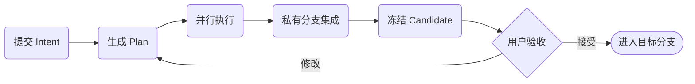

# 从 Intent 到可验收结果

这条阅读线按实际使用顺序解释：**用户目标 → structured Plan → 并行 Work → Review Candidate → 用户验收**。每篇只覆盖一个阶段，可从本页连续读完。

> 连续阅读：**流程总览** → [提交与规划](task-flow-1-planning.md) → [集成与候选](task-flow-2-integration.md) → [验收与回收](task-flow-3-delivery.md)

核心区别：**Task `completed` 只表示 Agent 交付了提交；Candidate `pending` 表示私有集成已经冻结为待验收结果，但尚未启动验收；只有用户显式验收并最终接受后，Candidate `integrated` 才表示代码已经进入目标分支。** `ready` 只表示验收报告已经可看，仍不等于落地。

## 流程全景

## 四段阅读路线

1. [提交与规划](task-flow-1-planning.md)：冻结输入基线，编译 Work DAG。
2. [集成与候选](task-flow-2-integration.md)：在私有 Intent 分支收敛，生成固定候选。
3. [验收与回收](task-flow-3-delivery.md)：接受、修改、诊断、证据与安全清理。
4. [核心架构](core-architecture.md)：从使用流程进入系统设计。

---

[下一篇：提交与规划 →](task-flow-1-planning.md)
